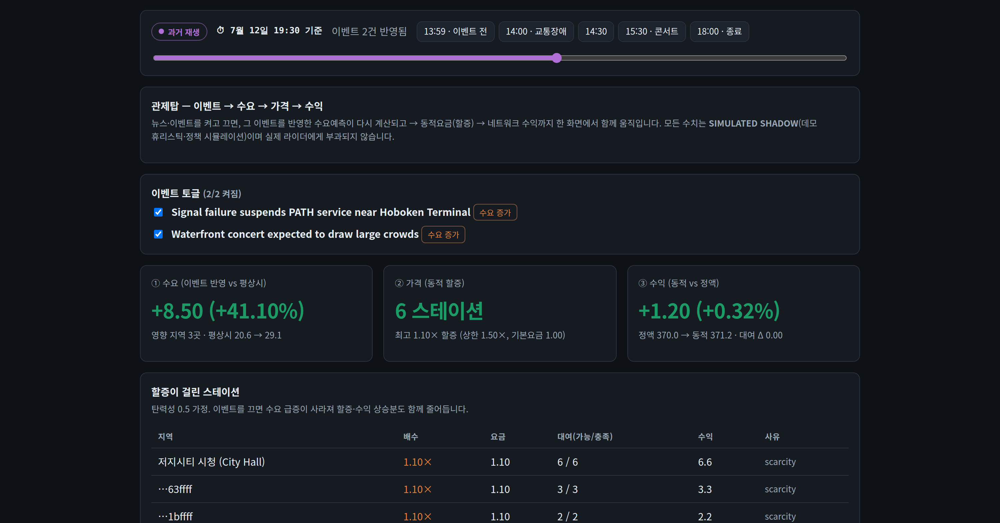
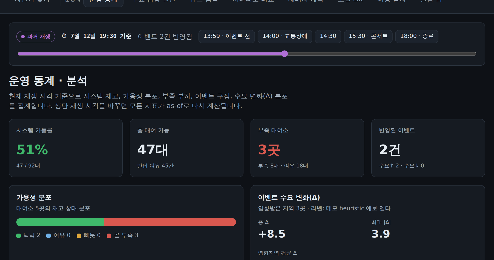
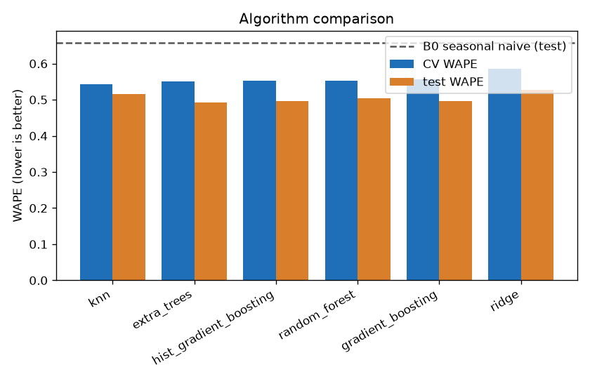
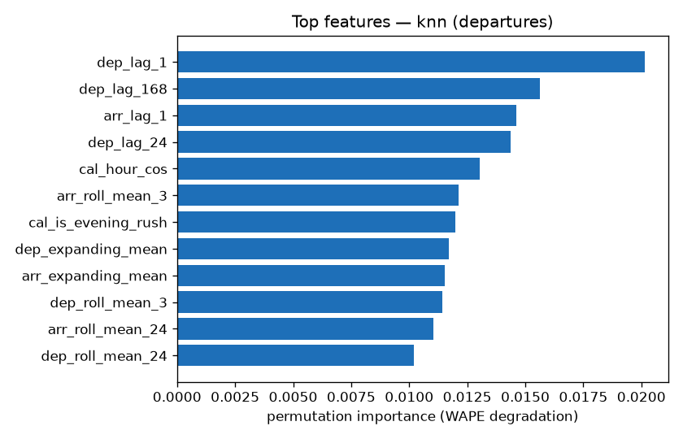

# ShockFlow AI

### 🔗 라이브 데모 — https://ai-pro-project-1.vercel.app

설치 없이 운영자 화면 전체(관제탑, 운영 통계, 재배치, 요금)를 바로 볼 수 있습니다. API는 무료
호스팅(Render free tier)이라 한동안 요청이 없으면 잠들고, 깨어나는 첫 접속에 30~60초가 걸립니다
(cold start). 그 뒤에는 빠르게 응답합니다. 설치해서 실행하거나 수치를 재현하는 방법은 아래
[빠른 확인 안내](#-빠른-확인-안내)에 있습니다.

---

이벤트를 인지하는 도시 모빌리티 수요 예측 및 차량 재배치 의사결정 지원 시스템입니다.

ShockFlow AI는 시간 정보가 붙은 이벤트에서 불규칙한 수요 충격을 감지해 추적 가능한 graph feature로
바꾸고, 이 feature가 예측에 준 model-attributed 영향(입증된 인과는 아닙니다)을 정량화한 뒤, 그
결과로 실행 가능한 재배치 계획을 만듭니다.

```text
Citi Bike 수요 이력
+ 시간 정보가 붙은 뉴스 / 이벤트 입력
+ 현재 station 재고
→ LLM 이벤트 추출 → Neo4j 이벤트 graph → as-of numeric graph feature
→ H3 Zone-시간 수요 예측 → 설명 및 시나리오 비교 → 실행 가능한 재배치 계획
```

개발 전반의 운영 계약은 [CLAUDE.md](CLAUDE.md)에 정리했습니다.

---

## 👀 빠른 확인 안내

1) 스크린샷, 2) 3분 실행, 3) 수치 재현 — 세 가지 방법으로 확인할 수 있습니다.
모두 API 키 없이 오프라인으로 동작합니다.

### 1. 메인 화면 (설치 없이 바로)

두 운영자 화면입니다.

관제탑 — 이벤트를 켜고 끄면 수요, 할증, 수익이 함께 움직입니다


운영 통계 — 재생 시점 기준으로 재고, 이벤트, 수요 변화를 한 화면에 집계합니다


### 2. 직접 실행 (약 3분, 키 불필요)

```bash
git clone https://github.com/jyhanqubit/AI_Pro_project && cd AI_Pro_project
make install                                # Python 가상환경 + 패키지
make api                                    # 백엔드: http://127.0.0.1:8000
# ── 새 터미널에서 ──
cd apps/web && npm install && npm run dev   # 프런트: http://localhost:3000
```

브라우저에서 http://localhost:3000 을 열고 우상단 "운영자"로 전환한 뒤 관제탑과 운영 통계 화면을
보세요. 관제탑에서 이벤트 토글을 끄면(이벤트를 반영하지 않은 기준값) 수요와 할증, 수익 상승분이
사라지는 것을 직접 확인할 수 있습니다. 운영 통계 화면의 운영 도우미는 이벤트 그래프에 근거해
답합니다. GPT/Claude 키를 넣으면 GraphRAG(LLM)로, 없으면 규칙 기반으로 동작합니다
([docs/LOCAL_GPT.md](docs/LOCAL_GPT.md)).

### 3. 수치 재현

가벼운 항목은 즉시 재현할 수 있고, 예측 lift는 원본 트립(약 3GB, 저장소 미포함 §7.1)을 내려받아야
재실행할 수 있습니다. 측정 결과 자체는 `reports/`에 커밋해 두어 다운로드 없이 바로 볼 수 있습니다.

| 핵심 결과 | 확인 / 재현 | 위치 |
|---|---|---|
| 재배치 부족 146→78(−47%), MILP = 완전열거 최적해 | `python -m optimization.demo` | 콘솔 출력 (오프라인) |
| GraphRAG: 검색 없는 raw LLM은 hallucination 10/10 → 근거 응답 0, 정답률 40%→100% | `python -m scripts.graphrag_eval` | 콘솔 출력 (오프라인) |
| 이벤트 그래프 node 5,770개 / edge 11,850개 | `make seed-graph` | `data/processed/graph/event_graph.json` |
| 이벤트 feature lift: **철회** — 원래의 +1.65%는 Jersey City 트립이 Staten Island로 오배정돼 섞인 결과였고, NYC 데이터만으로 다시 돌리면 −1.94%(CI [−6.09, −0.86])로 악화합니다 | 결과: `reports/borough_event_lift.json`, 재실행: `make download-citibike` 후 `python -m ml.forecasting.borough_event_lift` | `reports/`, [경위](docs/EVENT_LIFT_FINDINGS.md) |
| 방향별 lift (수요 급락 95.2% 적중) | 재실행: `python -m ml.forecasting.lift_direction` (트립 필요), 요약: [docs/EVENT_LIFT_FINDINGS.md](docs/EVENT_LIFT_FINDINGS.md) | `reports/`, `docs/` |
| 이벤트 피처 유무 ablation (H3 단위): 희소 이벤트(3개월 5건)는 개선 없음 — WAPE 0.5091(없음) vs 0.5105(있음) | 결과와 재실행 명령: `reports/event_feature_ablation.json` | `reports/` |
| **LLM 뉴스 피처의 조건부 기여**: 이벤트가 지역 특정적일수록 개선 — 평균 borough 4.2개 −0.96 → 2.0개 **+1.24 (CI [0.83, 1.64])**, 단조 관계 | `make v2-news-conditions` | `reports/v2/llm_value/news_feature_conditions.json` |
| 비대칭 비용 최적화: 0.667분위 예측으로 **운영비용(OCS) −3.4%, 품절 −26%** (3개 창 전부) | `make v2-quantile-cost` | `reports/v2/holdout/quantile_cost.json` |
| 승격 모델 실서빙 API — next-hour H3 예측 (holdout WAPE 0.4974) | 라이브/로컬: `GET /v2/model/forecast`, 재생성: `make v2-holdout` + `make v2-serving-export` | `reports/v2/holdout/` |
| 전체 테스트 | `make test` | 484 passed / 6 skipped (torch 없는 환경에서 v1 recsys 관련 테스트만 제외한 기준). `torch`를 설치하면 recsys retriever/reranker 테스트까지 함께 실행합니다 |

> Note. 화면의 `7/12` 수치는 라벨을 붙인 데모 리플레이(휴리스틱)이고, WAPE와 방향별 lift, 재배치는
> 실데이터 측정치입니다. GraphRAG 평가는 지표 설계를 보이기 위한 소규모(N=10) 하네스로, 답변은
> 예시이며 실제 LLM 출력으로 교체해 다시 채점할 수 있습니다. 자세한 구분은
> [docs/EVENT_LIFT_FINDINGS.md](docs/EVENT_LIFT_FINDINGS.md)와 [docs/STATUS.md](docs/STATUS.md)에 있습니다.

최신 릴리스의 측정 결과(promoted model, LLM feature 순가치, ledger, MPC, pricing, Copilot)는 아래
"V2 — LLM 순가치 검증" 섹션에 정리했습니다.

---

## 모델 Serving API

승격된 측정 모델을 API로 서빙합니다. `GET /v2/model/forecast`가 요청마다 `estimator.predict`를
실제로 실행해 H3 zone별 next-hour departures 예측을 반환합니다. 미리 계산한 답을 돌려주는 방식이
아닙니다.

반영 내역:

- Endpoint: `GET /v2/model/forecast?top=20` — 예측값 내림차순으로 상위 zone을 반환합니다.
- 모델: `hist_gradient_boosting` (H3 multi-holdout에서 승격, holdout WAPE 0.4974 ± 0.0074).
  Citi Bike JC 2026년 1~7월 트립으로 학습했고, 학습 row 226,953개, 학습 구간 마지막 시각
  2026-07-31 23:00 (America/New_York), serving 시점 2026-08-01 00:00입니다.
- Serving feature: `reports/v2/holdout/serving_features.json` — 학습 데이터가 끝난 다음 1시간(T+1)의
  feature snapshot, 활성 zone 136개. dfv1 feature는 시각 t에서 t 이전 시각의 값만 쓰므로 구조적으로
  leakage가 없습니다(§5.4).
- Provenance: 응답마다 `run_id`, `claim_status`, `freshness`, holdout WAPE를 함께 반환해, 서빙된
  수치를 measured 원본 artifact까지 추적할 수 있습니다.
- Degrade 동작: 모델 파일이나 feature snapshot이 없으면 503과 재생성 명령을 반환합니다. 이 경로는
  데모 휴리스틱으로 대체하지 않습니다.
- 재생성: `make v2-holdout` (모델 학습과 승격) 후 `make v2-serving-export` (serving snapshot).

```bash
curl "https://shockflow-api.onrender.com/v2/model/forecast?top=10"   # 라이브 (첫 요청은 cold start)
curl "127.0.0.1:8000/v2/model/forecast?top=10"                       # 로컬 (make api 실행 후)
```

월간 데이터 갱신: Citi Bike는 트립 이력을 월 단위로 약 2주 지연을 두고 공개하므로, 진짜 실시간
수요 label은 존재하지 않습니다. 대신 아래 세 명령으로 새 달이 공개될 때마다 모델과 serving 시점을
최신으로 당길 수 있습니다. 재고(GBFS station_status)는 실시간 공개 API라서 별도로 live 폴링이
가능하고, `ENABLE_GBFS_LIVE=true`로 켭니다(기본값은 꺼짐, 실패해도 Demo Mode는 유지).

```bash
make download-citibike MONTHS="202608" JC=1   # 새로 공개된 달 내려받기 (--jersey-city)
make v2-holdout                                # 재학습 + H3 multi-holdout + 모델 승격
make v2-serving-export                         # serving feature snapshot 갱신
```

### Latency (로컬 측정)

로컬 컨테이너(Linux, uvicorn single worker)에서 endpoint당 warm-up 10회 후 100회 요청으로
측정했습니다. 측정 스크립트가 출력한 수치를 그대로 적었습니다.

| Endpoint | p50 | p95 | p99 | Payload |
|---|---|---|---|---|
| `GET /v2/model/forecast?top=10` | 4.2 ms | 5.7 ms | 6.5 ms | 1.8 KB |
| `GET /v1/forecasts` | 2.1 ms | 3.0 ms | 3.2 ms | 1.1 KB |
| `GET /v2/operator/statistics` | 3.5 ms | 4.6 ms | 4.9 ms | 14.0 KB |
| `GET /v1/health` | 1.4 ms | 1.8 ms | 1.9 ms | 0.1 KB |

모델 추론 endpoint의 Latency가 p95 기준 5.7 ms입니다. 요청마다 추론을 실제로 도는데도 한 자릿수
ms인 이유는 serving feature snapshot을 미리 커밋해 두고, 요청 시점에는 행렬 구성과 `predict`만
수행하기 때문입니다. Render free tier 라이브 서버는 잠든 상태에서 깨어나는 첫 요청에 30~60초가
걸리고(cold start), 깨어난 뒤에는 위 수치에 네트워크 왕복 시간이 더해집니다. 참고로 hybrid 검색의
offline benchmark Latency는 p50 0.18 ms / p95 0.41 ms입니다(`reports/v2/search_relevance.json`).

### 전체 endpoint 개요

| 그룹 | Endpoint |
|---|---|
| 상태 / 리플레이 | `GET /v1/health`, `GET /v1/replay/state`, `POST /v1/replay/set-cutoff` |
| 예측 / 설명 | `GET /v1/forecasts`, `GET /v1/events`, `GET /v1/zones/{zone_id}/explanation`, `POST /v1/scenarios` |
| 모델 서빙 | `GET /v2/model/forecast`, `GET /v2/model/predictive-lift`, `GET /v1/model/lift` |
| 재배치 | `POST /v1/rebalancing/solve`, `POST /v2/operator/rebalancing/allocate` |
| 운영 | `GET /v2/operator/statistics`, `GET /v2/operator/timeline`, `GET /v2/cockpit/metrics`, `POST /v2/operator/ask` |
| 라이더 | `GET /v2/rider/stations/search`, `GET /v2/rider/search/hybrid`, `POST /v2/rider/ask`, `POST /v2/rider/plan-trip` |
| 요금 | `POST /v2/pricing/quote`, `POST /v2/pricing/revenue` |
| 뉴스 / 추천 | `POST /v2/news/sync`, `GET /v1/news/search`, `GET /v1/news/clusters`, `POST /v1/recommendations/stations` |

전체 스키마는 서버 실행 후 http://127.0.0.1:8000/docs (OpenAPI)에서 확인할 수 있습니다.

---

## 운영 모드

모든 레코드와 응답, 화면은 자신의 모드를 명시합니다. `demo_fixture`, `historical_replay`,
`live`, `research` 중 하나이고, Demo Mode는 외부 API 키 없이 오프라인으로 돌아갑니다.
실행 전에 `.env.example`을 `.env`로 복사하세요. 기본값은 오프라인에서 그대로 동작합니다.

<details>
<summary><b>전체 make 명령 보기</b></summary>

```bash
make install       # .venv 생성 + 패키지(editable)와 dev 도구 설치
make lint          # ruff check + format check
make typecheck     # mypy
make test          # pytest
make collect-demo    # 세 개의 fixture collector를 오프라인으로 돌리고 요약 출력
make build-features  # 수요 집계(H3 Zone x 로컬 시간) + 누수 방지 feature
make extract-events-demo  # 뉴스 fixture에서 이벤트 추출 (결정적 mock LLM)
make graph-upsert-demo    # 추출한 이벤트를 오프라인 event graph에 업서트 (idempotent)
make graph-features-demo  # 여러 cutoff에서 as-of graph feature 생성 (누수 방지)
make rebalance-demo       # 골든패스 재배치 계획 (greedy / MILP / exact / QUBO 검증), 오프라인
make api                  # 오프라인 replay API (127.0.0.1:8000, Demo Mode, 키 불필요)
make web                  # Next.js 운영자 UI (apps/web; 먼저 npm install 필요)
```

윈도우에서 `make`를 쓸 수 없다면 대응 명령을 직접 실행하세요
(예: `python -m venv .venv && .venv/Scripts/pip install -e ".[dev]"`).

</details>

## 저장소 구조

| 경로 | 용도 |
|------|------|
| `contracts/` | 경계 전반에서 공유하는 타입 지정 Pydantic v2 data contract (§6) |
| `services/api/` | FastAPI 서비스 (Phase 07) |
| `pipelines/collectors/` | 데이터 collector: Citi Bike, 뉴스 fixture, GBFS |
| `pipelines/events/` | LLM 이벤트 추출 |
| `pipelines/features/` | 수요 집계(H3 Zone x 로컬 시간) + 누수 방지 feature |
| `ml/forecasting/` | baseline 및 이벤트 인지 예측 모델 |
| `optimization/classical/` | Greedy / MILP 재배치 |
| `optimization/quantum/` | QUBO / QAOA 리서치 모드 |
| `apps/web/` | Next.js 운영자 UI (Phase 07) |
| `config/` | 타입 지정 런타임 설정 |
| `data/fixtures/` | 큐레이션한 버전 관리 데모 fixture |
| `data/raw/`, `data/processed/` | 로컬 입력 / 산출물 (git 무시) |
| `docs/` | PRD, 아키텍처, contract, 평가, 상태 |
| `tests/` | `unit/`, `integration/`, `e2e/` |

## 상세 기록

아래 네 섹션은 단계별 측정과 설계 기록입니다. 펼쳐서 보세요.

<details>
<summary><b>예측 모델링 상세 (Phase 06 — 지표 설계, leaderboard, feature 해석)</b></summary>


실데이터(Citi Bike JC, 2026년 6월)로 돌린 결과입니다. 목표는 `departures`(H3 Zone x 로컬 시간,
1시간 앞 forecast). 평가는 rolling-origin으로 했습니다 — 최근 72시간을 손대지 않은 out-of-sample
test로 빼고, 그 앞 구간을 expanding-window 3-fold로 CV했습니다. 랜덤 분할은 쓰지 않았고 seed는
42입니다. usable row 30,947개 / 139개 Zone, dev 26,918 / test 4,029, B1 feature 32개.

모든 수치는 실제 실행에서 나온 값이고 `make evaluate`로 재현할 수 있습니다. 원본은
`reports/phase06_results.json`, 상세 해석은 [docs/EVALUATION_PROTOCOL.md](docs/EVALUATION_PROTOCOL.md).

### 지표를 왜 이렇게 골랐나

지표는 데이터의 성질에 맞춰 골랐습니다. `departures`는 평균 2.7 / 중앙값 2 / 최대 87의
간헐적 카운트 수요로, 0인 시간이 20.2%, 2 이하가 64%이고, Zone별 평균 규모가 0~12로 극단적으로
다릅니다.

- percentage 계열(MAPE, sMAPE)은 탈락 — 0으로 나눠 폭발합니다.
- WAPE(Σ\|y−ŷ\|/Σ\|y\|) — 합산 정규화라 0에 강하고, 수요 큰 Zone과 시간대의 오차를 자동 가중합니다.
- MASE(seasonal naive 대비) — Zone 규모가 제각각이라 scale-free 지표가 필수입니다. 1보다 작으면 naive보다 낫습니다.
- MAE — "평균 몇 대 틀리나"의 직관적 보조 지표.
- peak direction accuracy — 재배치는 크기보다 오르내림 방향이 중요합니다.
- bias(평균 오차) — 체계적 과소예측, 즉 품절 위험을 감지합니다.
- OCS(Operational Cost Score) — 아래에서 설명하는 데이터/도메인 맞춤 지표.

### 알고리즘 leaderboard (GridSearch, CV WAPE 기준 정렬)

OCS는 아래 "맞춤 지표" 절 참고(shortage 2.0 / overflow 1.0). bias = 평균(ŷ − y), 음수면 과소예측.

| 알고리즘 | CV WAPE | test WAPE | test MASE | test OCS | bias | peak-dir |
|---|---|---|---|---|---|---|
| _B0 seasonal naive_ | - | 0.6584 | 1.0125 | 1.1473 | −0.867 | 0.559 |
| knn (CV 선택) | 0.5438 | 0.5161 | 0.7936 | 0.8571 | −0.451 | 0.632 |
| extra_trees | 0.5507 | 0.4922 | 0.7569 | 0.7809 | −0.231 | 0.640 |
| hist_gradient_boosting | 0.5522 | 0.4974 | 0.7649 | 0.7897 | −0.237 | 0.646 |
| random_forest | 0.5533 | 0.5047 | 0.7761 | 0.8015 | −0.241 | 0.642 |
| gradient_boosting | 0.5556 | 0.4972 | 0.7646 | 0.7905 | −0.243 | 0.636 |
| ridge | 0.5853 | 0.5268 | 0.8101 | 0.8559 | −0.357 | 0.626 |



### OCS — 데이터/도메인 맞춤 지표

수요 예측 오차는 방향이 비대칭입니다. 과소예측(ŷ<y)은 자전거 부족, 즉 품절(rider가 자전거를
못 찾음)로, 과대예측(ŷ>y)은 dock 초과와 헛된 재배치로 이어지는데, 보통 부족이 더 아픕니다. 그래서:

$$\text{OCS} = \frac{c_{short}\sum\max(y-\hat y,0) + c_{over}\sum\max(\hat y-y,0)}{\sum y}$$

기본 $c_{short}=2,\ c_{over}=1$ ([config/forecasting.py](config/forecasting.py), §11.5와 §14의 비용
가중치). 합산 정규화라 0에 강하고 scale-free이며, 두 비용이 같으면 정확히 WAPE로 환원됩니다 —
WAPE를 재배치 목적함수 쪽으로 굽힌 원리적 일반화이고, Phase 08 비용 모델과 직접 연결됩니다.

핵심 발견: 맞춤 지표가 순위를 바꿉니다. WAPE로 뽑은 knn이 OCS에서는 학습 모델 중 가장 나쁩니다
(0.857). knn이 더 심하게 과소예측(bias −0.451, 부족 3,730대)하는 반면, tree 계열은 덜 과소예측
(extra_trees bias −0.231, 부족 3,157대 → OCS 0.781로 최고)하기 때문입니다. 모든 모델이 과소예측
(음의 bias)이라 품절 위험이 구조적으로 존재하고, B0는 특히 심합니다(bias −0.867, OCS 1.147).
### 비대칭 비용을 손실함수까지 반영하기 (측정 결과)

OCS는 오랫동안 **지표**로만 쓰였습니다. 모델은 대칭 squared_error로 학습해 조건부 평균을 맞추고,
비대칭성은 평가와 재배치 목적함수에서만 반영됐습니다. 뉴스벤더 정리는 그 간극을 정확히 지목합니다 —
부족 비용 $c_s$, 과잉 비용 $c_o$일 때 비용을 최소화하는 점 예측은 평균도 중앙값도 아닌

$$q^* = \frac{c_s}{c_s + c_o}$$

분위수이고, OCS 가중치(2:1)에서는 **0.667**입니다. 실행 전에 이 예측을 artifact에 기록하고
(`newsvendor_q_star`), 손실함수만 바꿔가며 같은 rolling-origin 창에서 측정했습니다.

| loss | WAPE | OCS | bias | OCS 변화 |
|---|---|---|---|---|
| squared_error (기준) | 0.4974 | 0.7525 | −0.033 | — |
| quantile q=0.5 | **0.4903** | 0.7895 | −0.281 | +4.92% |
| quantile q=0.6 | 0.5124 | 0.7447 | +0.126 | −1.04% |
| **quantile q=0.667** | 0.5391 | **0.7268** | +0.428 | **−3.42%** |
| quantile q=0.75 | 0.5979 | 0.7361 | +0.839 | −2.18% |
| quantile q=0.8 | 0.6569 | 0.7679 | +1.134 | +2.05% |

**OCS 곡선은 q=0.667에서 최소인 U자**로, 이론이 지목한 지점과 일치합니다. 3개 홀드아웃 창
**전부**에서 q=0.667이 최적이었고, 부족 대수가 창별로 25,184→18,704 / 27,327→19,854 /
27,262→20,105으로 **평균 26% 감소**했습니다.

대가는 명시합니다 — **WAPE는 0.4974에서 0.5391로 8.4% 나빠집니다.** 정확도를 내주고 운영 비용을
얻은 것이므로 두 지표를 항상 나란히 보고합니다. 중앙값(q=0.5)이 WAPE는 가장 좋지만(0.4903) OCS는
기준보다 나쁘다는 점(+4.92%)이, 정확도 지표만 보면 운영상 잘못된 모델을 고르게 된다는 위의 발견을
다시 확인해 줍니다.

재현: `make v2-quantile-cost` → `reports/v2/holdout/quantile_cost.json`

즉 정확도(WAPE)만 보면 knn이지만, 품절 비용까지 보면 extra_trees가 운영상 더 낫습니다 — 이것이 이
데이터에 맞춘 지표를 따로 둔 이유입니다. (선택 자체는 프로토콜대로 CV WAPE로 하되, 운영 관점의
재순위를 함께 보고합니다.)

### 모델 해석

best 모델은 CV WAPE 기준으로 knn(`n_neighbors=30`, `weights=distance`)을 선택했습니다. test에서
WAPE 0.5161, MASE 0.7936 — MASE가 1보다 작으니 주간 seasonal naive를 이깁니다(B0 대비 test WAPE
약 21.6% 개선). 다만 짚어두면, 손대지 않은 test 창에서는 extra_trees(0.4922)와 boosting
계열(약 0.497)이 knn을 근소하게 앞섭니다. 선택은 프로토콜대로 test가 아닌 CV로 했기 때문에
knn을 대표 모델로 보고합니다. tree/knn 계열은 test WAPE 0.49~0.53 구간에 촘촘히 모여 있어, 이
데이터에서는 알고리즘 종류보다 feature가 성능을 좌우한다는 뜻입니다.

### best hyperparameter 해석

| 파라미터 | 값 | 의미 |
|---|---|---|
| `n_neighbors` | 30 | 예측에 평균 내는 이웃 수. 30개로 크게 잡아 노이즈에 강하고 매끄러운 예측. |
| `weights` | distance | 가까운 이웃일수록 큰 가중치 → 지역 demand 수준을 더 정확히 반영. |

이웃을 5나 15가 아니라 30으로 크게, 그리고 거리 가중을 준 조합이 CV에서 가장 안정적이었습니다. 개별
시점의 튐(noise)에 휘둘리지 않고 최근의 유사 패턴을 넓게 평균하는 쪽이 이 수요 데이터에 맞았다는 신호입니다.

### feature 해석 (permutation importance, test holdout 기준)

feature를 하나씩 섞었을 때 WAPE가 얼마나 나빠지는지로 측정했습니다(값이 클수록 의존도 큼).

| 순위 | feature | 중요도 | 의미 |
|---|---|---|---|
| 1 | `dep_lag_1` | 0.0202 | 직전 시간 departures — 단기 지속성 |
| 2 | `dep_lag_168` | 0.0156 | 1주일 전 같은 시각 — 주간 seasonality |
| 3 | `arr_lag_1` | 0.0146 | 직전 시간 arrivals |
| 4 | `dep_lag_24` | 0.0144 | 하루 전 같은 시각 |
| 5 | `cal_hour_cos` | 0.0130 | 시각(hour-of-day) 순환 인코딩 |
| 6 | `arr_roll_mean_3` | 0.0121 | 최근 3시간 arrivals 평균 |
| 7 | `cal_is_evening_rush` | 0.0120 | 저녁 러시(16-18시) |
| 8 | `dep_expanding_mean` | 0.0117 | 해당 Zone의 누적 평균 demand(규모) |

해석하면, 단기 지속성(직전 시간)이 가장 강하고, 그다음이 주간(168h)과 일간(24h) seasonality,
그리고 시각과 저녁 러시 같은 calendar 신호와 Zone별 demand 규모입니다. EDA에서 확인한 "평일/주말
차이는 총량보다 타이밍(저녁 러시)에서 온다"는 결론과 일치합니다.



feature selection: 상위 12개만 남겨 다시 학습하면 test WAPE 0.512로, 32개 전체(0.5161)와
동등하거나 오히려 근소하게 낫습니다. 예측력의 대부분이 소수의 history feature에 몰려 있다는 뜻입니다.

### ablation B0–B4 (측정 결과 그대로)

| 단계 | feature | WAPE | MAE | MASE |
|---|---|---|---|---|
| B0 (seasonal naive) | - | 0.6584 | 1.787 | 1.0125 |
| B1 (demand history + calendar) | 32 | 0.5161 | 1.401 | 0.7936 |
| B2 (+ article counts) | 34 | 0.5161 | 1.401 | 0.7936 |
| B3 (+ LLM event features) | 37 | 0.5161 | 1.401 | 0.7936 |
| B4 (+ graph-propagated features) | 40 | 0.5161 | 1.401 | 0.7936 |

해석: 이 6월 평가 창에서 유일한 curated 이벤트는 데이터보다 뒤인 2026-07-12라, 가용성
규칙(§5.2)에 따라 모든 event/graph feature가 0이 됩니다. runner가 창의 마지막 cutoff
(2026-06-30 23:00)에서 `build_graph_features`를 호출해 snapshot 0개임을 실제로 확인했고, 그래서
B2–B4는 B1과 완전히 같고 B4−B1 forecast delta도 0입니다. 즉 이벤트 효과는 이 창에서는 입증할 수
없고, 입증하려면 curated 이벤트와 겹치는 평가 구간이 필요합니다(가짜 뉴스 생성은 §22로 금지).
이후 2026년 5~7월 데이터로 이벤트가 학습 구간에 실제로 들어가는 조건에서 같은 ablation을 다시
측정했고, 결과는 `reports/event_feature_ablation.json`에 있습니다(희소 이벤트로는 개선 없음).
event-aware 로직 자체는 as-of 누수 테스트(`tests/unit/test_graph_features.py`, 14:01→14:00
회귀 포함)가 별도로 검증합니다. 한계는 [docs/KNOWN_LIMITATIONS.md](docs/KNOWN_LIMITATIONS.md) 참고.

</details>

<details>
<summary><b>재배치 & 양자 리서치 모드 (Phase 08 — MILP, QUBO 검증)</b></summary>


예측을 실제 운영 조치로 연결하는 Act 단계입니다(§13, §14). 각 station은 현재 재고와 용량,
목표(target) 재고를 갖고, 목표를 맞추도록 이동 예산(`vehicle_capacity`) 안에서 자전거를 정수
단위로 옮깁니다.

- 목적함수(비대칭, §14.1) — `shortage_cost × 부족 + overflow_cost × 과잉 + distance_cost × 이동거리`.
  부족(품절로 인한 trip 손실)을 과잉보다 무겁게(기본 3:1) 둡니다. Phase 06의 OCS 지표와 같은 비대칭 철학입니다.
- solver 사다리 — ① Greedy(항상 feasible, do-nothing보다 나쁘지 않음) → ② MILP(`scipy.optimize.milp`,
  정확 최적) → ③ enumeration oracle(작은 instance 완전 탐색). 테스트에서 MILP 비용 == enumeration
  비용(최적)이고 greedy 이하임을 검증합니다.
- feasibility 명시(§14.1) — 출발지 재고 초과, 도착지 용량 초과, 음수/비정수 이동, 차량 용량 초과를
  명시적으로 거부하고 사람이 읽는 사유를 반환합니다. 이 검사를 통과한 계획만 화면에 표시합니다.
- 이벤트 연동 — 이벤트가 노출된 zone은 as-of `demo-heuristic-v1` forecast delta만큼 target이
  올라가 부족이 생기고, solver가 조용한 zone(Grove St, Exchange Place)에서 자전거를 옮겨옵니다.
  이벤트 전에는 target=base라 계획이 비어 있습니다. (측정된 Phase 06 모델이 아니라 라벨을 붙인 데모 heuristic)
- 양자 리서치 모드(§14.2, 리서치 전용) — 작은 instance를 QUBO로 매핑하고, QUBO 최적 == 완전
  탐색 최적임을 검증합니다(모든 비트 벡터에서 에너지 일치, crafted instance에서는 MILP 계획과 일치).
  QAOA는 선택입니다(`qiskit` 없으면 "unavailable" 경로 + 사유를 명시하고 skip). 시뮬레이터이며
  하드웨어가 아니고, 양자 우위 주장은 하지 않습니다.

자세한 매핑과 검증은 [docs/OPTIMIZATION.md](docs/OPTIMIZATION.md)에, 90초 골든패스는
[docs/DEMO_SCRIPT.md](docs/DEMO_SCRIPT.md)에 있습니다. 한계는
[docs/KNOWN_LIMITATIONS.md](docs/KNOWN_LIMITATIONS.md) 참고.

</details>

<details>
<summary><b>V1 (모델, 추천, 실험, 이상탐지, 라이브)</b></summary>


v0 위에 backward-compatible 증분으로 V1을 구현했습니다 — 측정된 모델 스토리(B0–B4),
어텐션 듀얼인코더 추천 + reranker + 정책, 동적 인센티브와 정책 시뮬레이션, 클러스터드 스위치백 실험,
이상 탐지, 라이브 섀도(pending label), FAISS 뉴스 벡터 스토어(누적 수집, 의미 검색, 같은 사건 클러스터).
웹 콘솔은 8개 화면입니다. 모든 값은 measured / pending / simulated / blocked 중 하나로 명시합니다.

```bash
make v1-collect-news-live     # (opt-in) 실제 GDELT 뉴스 수집 → FAISS 스토어에 누적
make v1-build-event-features  # 증분 그래프 피처 == 전체 재빌드 검증
make v1-evaluate-anomalies    # 4개 이상 탐지기 (합성 결함 시나리오)
make v1-experiment-dry-run    # A/A + 정책 스위치백 (simulated)
make v1-live-fixture          # 라이브 섀도 마이크로배치 (pending label)
make v1-news-vectorstore      # FAISS 의미 검색 + 같은 사건 클러스터
```

전체 계획과 실행 로그, 감사는 [docs/V1_PORTFOLIO_SUMMARY.md](docs/V1_PORTFOLIO_SUMMARY.md),
[docs/V1_DEMO_SCRIPT.md](docs/V1_DEMO_SCRIPT.md),
[docs/V1_EXECUTION_LOG.md](docs/V1_EXECUTION_LOG.md), `reports/v1/V1_FINAL_AUDIT.md` 참고.

</details>

<details>
<summary><b>V2 사용성 업데이트 (UI, 검색, 운영 통계)</b></summary>


V1 위에 backward-compatible 증분으로 사용성에 초점을 맞춘 업데이트를 더했습니다. 새 모델이나 가격,
실험 주장은 없고, 모든 값은 오프라인에서 계산하며 수요 변화(Δ)는 라벨을 붙인 데모
heuristic(`demo-heuristic-v1`)입니다.

- 라이더 홈 리디자인 — 공유자전거 앱 스타일의 검색바 + 필터 칩 + 대여소 리스트 + 상세 시트.
- 대여소 검색 — `GET /v2/rider/stations/search?q=…` (한글/영문/별칭/오타 허용 부분일치;
  재고는 항상 운영 fixture에서 hydrate하고, 검색어에서 추론하지 않습니다). 빈 검색어는 전체를 가용성순으로 정렬합니다.
- 운영 통계 — `GET /v2/operator/statistics` (시스템 가동률, 가용성 분포, 부족 부하, 이벤트 구성,
  수요 Δ 분포, 지역별 상세)를 새 `/statistics` 화면에서 시각화합니다.
- 이벤트 윈도우 타임라인 — `GET /v2/operator/timeline` (재생 윈도우 12–18시를 매 시각 as-of로
  재계산한 부족, Δ, 이벤트 시계열)을 인라인 SVG 차트로 시각화합니다. 이벤트 공개 이전의 flat 구간이
  leakage 경계를 그대로 보여줍니다.
- 추가 자전거 최적 분배 — `POST /v2/operator/rebalancing/allocate` (운영자가 추가 자전거 m대를
  입력하면, 부족한 대여소에 어떻게 나눠야 이익이 최대일지 계산합니다). 비대칭 목적(부족 3 : 과잉 1)이
  분리 가능한 볼록 형태라 greedy 한계이익 배분이 전역 최적이고, 완전탐색과 일치함을 검증했습니다.
  목표 충족 뒤 남는 자전거는 창고 보유로 그대로 보고합니다. `/rebalancing` 화면 상단의
  "추가 자전거 최적 분배" 카드에서 m을 입력합니다.

```bash
make api    # v1 + v2 엔드포인트 (오프라인, :8000)
curl "127.0.0.1:8000/v2/rider/stations/search?q=시청"
curl "127.0.0.1:8000/v2/operator/statistics"
curl "127.0.0.1:8000/v2/operator/timeline"
make web    # /  (라이더 홈)  및  /statistics  (운영 통계)
```

휴대폰에서 보기 (같은 Wi-Fi): 라이더 UI는 모바일 반응형입니다. 두 개의 터미널에서 아래를 실행한 뒤,
폰 브라우저에서 `http://<PC IP>:3000` 으로 접속하세요. 여전히 오프라인(키 불필요)이고 로컬 네트워크만
접근할 수 있습니다.

```bash
make api-lan                      # API를 0.0.0.0:8000 으로 (LAN 노출)
make web-lan LAN_IP=192.168.0.10  # PC의 실제 IP로 교체 (macOS: ipconfig getifaddr en0, Linux: hostname -I)
```

자세한 스펙과 재현 방법은 [docs/V2_UX_UPDATE.md](docs/V2_UX_UPDATE.md), 실제 배포(라이브 뉴스 동기화,
Elasticsearch, LAN 등)는 [docs/DEPLOYMENT.md](docs/DEPLOYMENT.md) 참고.

</details>

## V2 — LLM 순가치 검증 (V2-00 … V2-09)

위의 "V2 사용성 업데이트"가 UI/UX 릴리스라면, 이 절은 그와 별개인 LLM net-business-value 검증
릴리스입니다(계약: [CLAUDE_V2_APPEND_REVISED.md](CLAUDE_V2_APPEND_REVISED.md)). 핵심 질문은 하나입니다 —
LLM/event feature가 예측 정확도를, 그리고 그 정확도가 (LLM 비용을 제하고도) 이익을 실제로 개선하는가?
모든 결과는 `reports/v2/**`의 versioned artifact가 뒷받침하고, 각 값에는 `run_id / artifact_id / mode /
claim_status / freshness`를 담은 `ResultEnvelope`로 라벨을 붙였습니다. 완성 판정은 기능 존재 여부가 아니라
artifact 기준입니다. 각 알고리즘의 원리와 metric 정의는 [docs/v2/V2_ALGORITHMS.md](docs/v2/V2_ALGORITHMS.md)에
정리했습니다.

측정된 결과 (measured / simulated, artifact 링크):

| 결과 | claim_status | 수치 | 재현 |
|---|---|---|---|
| Promoted model + H3 multi-holdout | measured | `hist_gradient_boosting`, 2026년 1~7월 트립, rolling-origin 3-window: WAPE 0.4974 ± 0.0074, MASE 0.8708 ± 0.0094 (naive WAPE 0.65~0.69를 이김) | `make v2-holdout` |
| **비대칭 비용 최적화 (뉴스벤더 q\*)** | **measured** | 손실함수를 0.667분위로 바꿔 OCS 0.7525 → 0.7268 (**−3.42%**), 품절 대수 **−26%**, 3개 창 전부에서 q=0.667이 최적. 대가로 WAPE +8.4%. 예측을 실행 전에 artifact에 기록 | `make v2-quantile-cost` |
| 실서빙 모델 API | measured | `GET /v2/model/forecast` — 요청마다 promoted 모델이 next-hour 예측 (serving 시점 2026-08-01), Latency p95 5.7 ms (로컬) | `make v2-serving-export` |
| Structured event feed lift (A1−A0) | measured, **재현 실패** | 단일 분할(2026-05)에서는 `MEANINGFUL_POSITIVE` +2.69%였으나, rolling origin 6창에서 유의한 양수가 0개. 개선 주장을 철회합니다 | `make v2-llm-value-rolling` |
| **LLM 뉴스 피처의 조건부 기여 (A2−A1)** | **measured (조건부)** | 이벤트의 **공간 해상도에 따라 방향이 갈림.** 시드 10 앙상블 기준 이벤트당 평균 borough 수로 정렬하면 gain이 **단조 상승**: 4.2개 −0.96 / 3.7개 −0.86 / 2.3개 −0.76 / **2.0개 +1.24 (CI [0.83, 1.64])**. 2개 borough 부근에서 부호가 바뀝니다 | `make v2-news-conditions` |
| 조건부 결과의 메커니즘 검증 | measured | 학습량 가설 기각(테스트셋 고정 시 6월 −0.32→+1.24, 5월 0.00→−0.76으로 **반대 방향**). 단일 시드는 난수가 지배(같은 창이 +2.23 ↔ −2.26) → 앙상블 필요 | `make v2-news-conditions` |
| Profit / Regret ledger | simulated | no-action 대비 net +$103,271 (9개 cost 설정 모두 부호 양수); Oracle 대비 regret $218,697 | `make v2-ledger` |
| MPC vs No-Action/Greedy/MILP/Oracle | simulated | ledger total_cost: NoAction 1127 / Greedy 1155 / MILP 1087 / MPC 740 / Oracle 719 — MPC가 best feasible, regret 21.6 | `make v2-mpc` |
| Dynamic pricing + guardrail | simulated | 576 zone-hour에서 guardrail 위반 0, A/A CI가 0 포함 (shadow quote만) | `make v2-pricing` |
| Copilot 정확도 + grounding | offline_benchmark | typed-tool routing 1.0, numeric hallucination 0; RAGAS faithfulness 1.0, answer_relevancy 0.985; trip-plan faithfulness 1.0 | `make v2-copilot` |
| Final audit (완성 판정) | measured | envelope honesty + completion-artifact + traceability 3 gate PASS, 31 artifacts → V2_COMPLETE | `make v2-final` |

```bash
make v2-audit             # V2-00: domain-drift + result-envelope 계약 gate (오프라인)
make v2-holdout           # V2-01: promoted model + H3 multi-holdout (원본 트립 필요)
make v2-serving-export    # V2-07: promoted 모델의 next-hour serving feature 스냅숏
make v2-quantile-cost     # V2-01: 비대칭 비용 분위수 sweep (뉴스벤더 q* 검증)
make v2-ledger            # V2-02: profit/regret ledger
make v2-llm-value-borough # V2-03: No-Event / Rule-Event / LLM-Event ablation + CI + LLM 비용
make v2-llm-value-rolling # V2-03: 같은 ablation을 월별 rolling origin에서 반복 (창마다 재학습, 부호 일관성)
make v2-mpc               # V2-04: multi-period 정책 비교 (No-Action/Greedy/MILP/MPC/Oracle)
make v2-pricing           # V2-05: bounded dynamic pricing + guardrail audit + A/A dry-run
make v2-copilot           # V2-06: typed-tool grounding + GraphRAG + RAGAS 벤치마크
make v2-monitor           # V2-08: run manifest + freshness + delayed-label loop (leakage-safe)
make v2-final             # V2-09: 최종 audit → reports/v2/final/claim_matrix.json
make v2-rl                # (research 전용) tabular Q-learning + PPO 재배치 정책
```

결과를 읽는 기준:
- Measured 성과 — promoted forecaster가 seasonal naive를 세 holdout 창 모두에서 이기고, Copilot은
  typed tool 덕분에 numeric hallucination이 0입니다.
- 철회한 주장 (중요) — structured event feed의 A1−A0 개선(+2.69%)은 **단일 분할에서만 성립했고
  재현되지 않았습니다.** 월별 rolling origin으로 다시 측정하니 2026-05는 +3.96 (CI [1.02, 6.68]),
  2026-06은 −3.46 (CI [−6.10, −0.92])으로 부호가 뒤집혔습니다. 원래 결과의 test 구간이 사실상
  2026년 5월 한 달이었다는 것도 이 과정에서 드러났습니다(n=2,975 / 31 day-blocks가 정확히 일치).
  기존 artifact는 지우지 않고 남겨 두었고, 재현 실패를 나란히 기록했습니다:
  `reports/v2/llm_value/rolling_origin_ablation.json`. 이 단일 분할 위에 세운 density curve와
  quality ablation도 같은 조건부라는 점을 함께 밝힙니다.
- 개선 없음도 그대로 보고 (대표 발견) — 이 데이터에서 LLM-from-news feature는 수요 예측을 개선하지
  않습니다. 이 부정적 결론은 rolling origin에서도 유지됐습니다(측정 가능한 두 창 모두 음수,
  `consistently_negative`). LLM Feature Value metric + CI로 보고하고 root cause까지 규명했습니다
  (source가 dense + precise-time + precise-location + forward-looking이어야 하는데 news는 하나도
  만족하지 못함). simulated synthetic ceiling(+10.43%)으로 "방법 자체는 조건을 만족하면 동작"함을
  보였습니다. 전체 정리: [docs/v2/V2_WHY_LLM_FEATURES.md](docs/v2/V2_WHY_LLM_FEATURES.md).
- Simulated는 measured가 아님 — 모든 금액(ledger, MPC, pricing)은 assumption에 조건부라 `simulated`로
  라벨을 붙였습니다. 단위 수량만 measured입니다.
- Research 전용, 완성 조건 아님 — RL(tabular Q-learning + PPO)과 QAOA. RL은 같은 ledger로 채점하면
  PPO 202.9 < tabular 247.8이고, 둘 다 MPC 21.6에 못 미쳐 RL advantage는 주장하지 않습니다.
  `ResultEnvelope`가 research 값을 product surface에서 차단합니다.
  ([docs/v2/V2_RESEARCH_RL.md](docs/v2/V2_RESEARCH_RL.md))

계획과 claim matrix, 한계는 [docs/v2/README.md](docs/v2/README.md),
[docs/v2/V2_CLAIMS_MATRIX.md](docs/v2/V2_CLAIMS_MATRIX.md),
[docs/v2/V2_KNOWN_LIMITATIONS.md](docs/v2/V2_KNOWN_LIMITATIONS.md), 최종 감사는
[reports/v2/final/v2_final_audit.md](reports/v2/final/v2_final_audit.md) 참고.

## 상태

현재 진행 중인 단계와 검증된 명령, 남은 걸림돌은 [docs/STATUS.md](docs/STATUS.md)에서 확인하세요.
